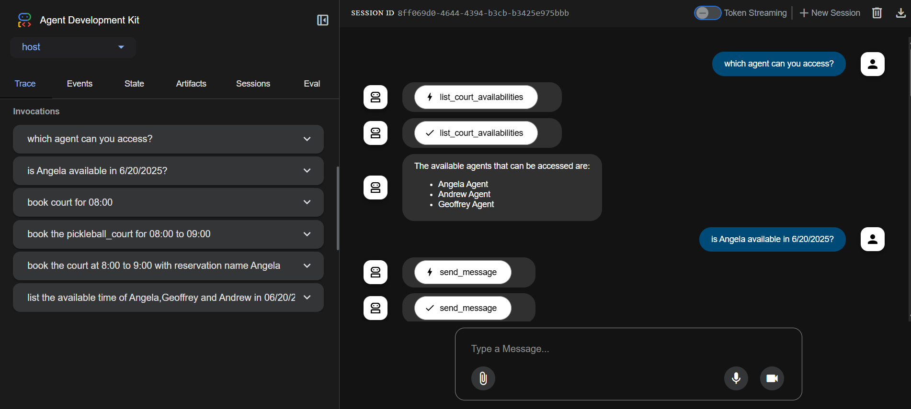

# 🤝 A2A Time Scheduler

A multi-agent orchestration demo that showcases how conversational agents can coordinate to schedule a meeting between participants with individual preferences and availability. Built on top of Google’s [A2A Protocol](https://ai.google.dev/docs/a2a_overview), this project includes local and remote agents using various agent frameworks, communicating seamlessly to achieve a goal.



---

## 🧠 Agents Involved

This application runs **four agents**, each simulating a persona in a meeting scheduling task:

- **🧑‍💼 Host Agent (ADK)**  
  Orchestrates the conversation and initiates the scheduling process.

- **📅 Geoffrey Agent (LangGraph)**  
  Represents Geoffrey’s calendar and preferences.

- **📅 Angela Agent (ADK)**  
  Represents Angela’s calendar and preferences.

- **📅 Andrew Agent (CrewAI)**  
  Represents Andrew’s calendar and preferences.

---

## ⚙️ Features

- ✅ Multi-agent communication using the **Agent-to-Agent Protocol (A2A)**.
- 🔄 Local coordination between **heterogeneous agents** using different frameworks (LangGraph, ADK, CrewAI).
- 💬 Asynchronous scheduling dialogues.
- 🧪 Uses **local Ollama models** for LLM inference — no cloud LLMs required.
- 📁 Modular and extensible design for adding new agents or skills.

---

## 🚀 Setup and Deployment

### 🛠️ Prerequisites

Before you start, make sure you have the following installed:

1. [**uv**](https://docs.astral.sh/uv/getting-started/installation/) – Python package and virtualenv manager
2. **Python 3.13+** – Required to run the `a2a-sdk`
3. **Ollama (Optional)** – If using local LLMs (e.g., `llama3`, `mistral`)

### 🔐 Environment Variables

Create a `.env` file in the root of `a2a_friend_scheduling/`:

```env
GOOGLE_API_KEY="your_api_key_here" (optional if wanna use paid model)
Else,just use free OLLAMA model.

### Terminal 1: Run Geoffrey Agent
```bash
cd Geoffrey_agent_langgraph
uv venv
source .venv/bin/activate
uv run --active app/__main__.py
```

### Terminal 2: Run Andrew Agent
```bash
cd Andrew_agent_crewai
uv venv
source .venv/bin/activate
uv run --active .
```

### Terminal 3: Run Angela Agent
```bash
cd Angela_agent_adk
uv venv
source .venv/bin/activate
uv run --active .
```

### Terminal 4: Run Host Agent
```bash
cd host_agent_adk
uv venv
source .venv/bin/activate
uv run --active adk web      
```

## Interact with the Host Agent

Once all agents are running, the host agent will begin the scheduling process. You can view the interaction in the terminal output of the `host_agent`.


